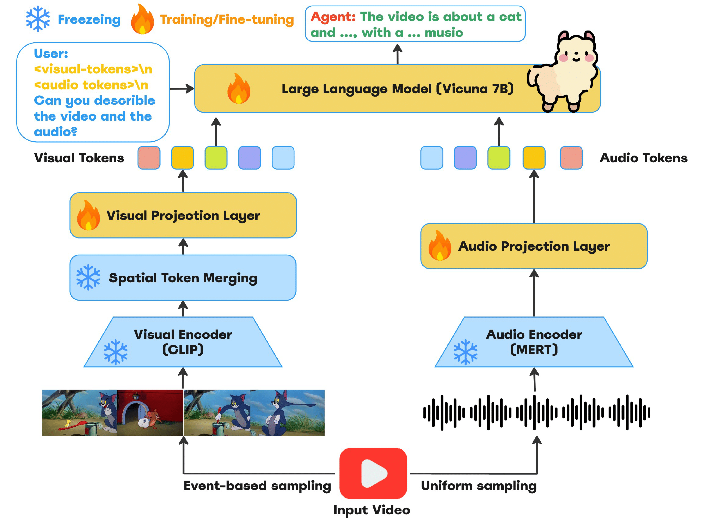
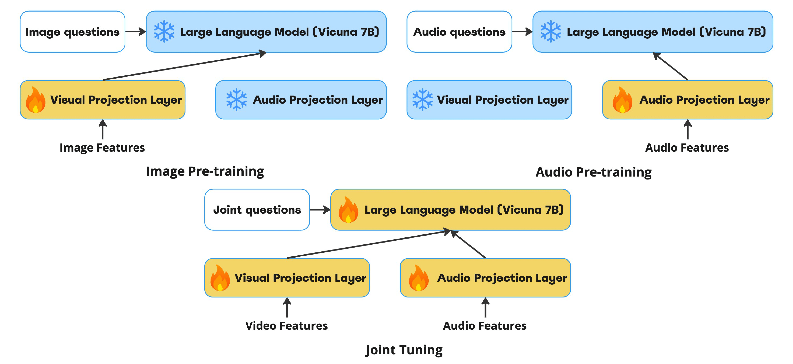

# Watch and Listen: Personalized Video Summarization with Multi-Modal Learning

### Abstract

Video summarization is key to managing the ever-growing volume of video content. Personalized summarization, which tailors highlights to individual preferences, offers a more engaging and relevant viewing experience. However, understanding user preferences from video content requires leveraging multiple modalities, including visual, auditory, and textual information. Traditional approaches often fail to integrate these modalities effectively, limiting their ability to create accurate and personalized summaries. In this project, we introduce a multi-modal learning framework that combines information from both video and audio sources to create personalized video summaries. Evaluation results on benchmark datasets demonstrate that our approach achieves competitive performance relative to state-of-the-art models. Overall, our framework advances video summarization by incorporating diverse modalities to produce contextually rich and personalized summaries, offering promising directions for future research in dynamic multimedia environments.

### Methods

<b>Multi-modal pipeline for personalized video summarization.</b> The system uses event-based sampling for visual frames (processed by CLIP with spatial token merging) and uniform sampling for audio (processed by MERT). The resulting tokens are projected and then fused in a Large Language Model (Vicuna 7B), enabling user-guided video summaries through a three-stage training and fine-tuning process.

<b>Three-stage training paradigm for multimodal summarization.</b> The first two stages
separately pretrain the visual and audio projection layers while freezing the Large Language Model.
In the final stage, both modules are jointly tuned with video inputs, integrating image and audio
features for end-to-end optimization

### Running Our Code
- Checkout the `preprocess` folder for data preparation code.
- Checkout the `src/scripts` folder for training and evaluation scripts.
